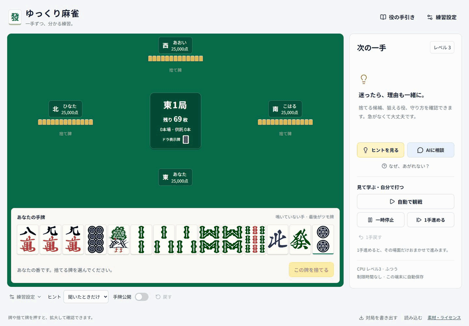

[](https://inata169.github.io/yukkuri-mahjong/)

# ゆっくり麻雀

初心者が、時間を気にせず「なぜこの牌を捨てるのか」を学べる4人打ちリーチ麻雀です。1人＋CPU3人で遊びます。スマートフォンは縦持ちを優先し、横持ちとPCにも対応します。

## できること

- ヒントなし／聞いたときだけ／いつも表示を切り替える
- 5段階のCPUと対戦する
- 旧CPU／改善版CPUを選ぶ。改善版は守備と鳴きの判断を追加
- 「CPU比較」で旧版と改善版を自動対戦させ、順位・収支・和了率・放銃率を比較する
- 自動で観戦し、好きな場面から自分で打つ。再び自動にも戻せます
- 一時停止、1手ずつ進行、直近24手までの巻き戻し
- 相手の手牌を公開し、拡大して見る
- 山に残る牌を、次に引く順に見る（王牌は除外）
- 同じ配牌・同じ山から、その局をやり直す
- リーチ・タンヤオ・役牌を狙いやすい練習配牌を選ぶ
- ChatGPTなどに貼り付ける、現在の局面の相談文をコピーする
- 代表的な役の手引き、あがれない理由、捨てた手の振り返りを見る
- この端末に自動保存し、JSONファイルの書き出し・読み込みで他の端末へ移す

ヒント・公開設定・CPUの強さ・自動観戦は自由に組み合わせられます。鳴き、リーチ、ツモ・ロン、カン、流局、連荘、点数計算は `@kobalab/majiang-core` を利用しています。

## 起動

### インストールなしで試す

同梱の `yukkuri-mahjong.html` をPCのブラウザーで開きます。牌・フォント・プログラムを内蔵した単体ファイルです。ブラウザーの制約でコピーや自動保存が使えない場合は、文章の手動コピー／対局を書き出す機能を使えます。スマートフォンは、GitHub Pagesに公開したURLからの利用を推奨します。

### 開発する

Node.js 24 LTSを推奨します。

```bash
npm ci
npm run dev
```

表示されたローカルURLを開きます。WindowsのPowerShellでも同じコマンドです。

```bash
npm test
npm run build
```

公開用のファイルは `docs/` に出力されます。`public/` の牌・日本語フォントもコピーされます。配信先でJavaやNode.jsのサーバーを動かす必要はありません。

## GitHub Pagesに公開する

リポジトリは [inata169/yukkuri-mahjong](https://github.com/inata169/yukkuri-mahjong)、公開先は [ゆっくり麻雀](https://inata169.github.io/yukkuri-mahjong/) です。

1. ソースを変更したら、`npm ci`、`npm test`、`npm run build` を実行します。
2. ソースと更新された `docs/` を一緒にコミットし、`main` へpushします。`node_modules/`、秘密情報、ZIPは追加しません。
3. リポジトリの **Settings → Pages** を開きます。
4. **Source: Deploy from a branch**、**Branch: main**、**Folder: /docs** を選んで保存します。
5. 公開が完了したら、Pages画面に表示されたURLを開きます。

`docs/index.html` が公開ページの入口です。牌SVGは `docs/tiles/`、日本語フォントは `docs/fonts/` から読み込み、`docs/.nojekyll` で静的ファイルをそのまま配信します。

以後はソースの変更後に `npm run build` を実行し、ソースと更新された `docs/` を一緒にコミットします。相対パスでビルドしているため、リポジトリ名を変更しても配信できます。

## 初期ルール

日本の4人打ちリーチ麻雀、25,000点持ち、東風戦です。設定から半荘戦にもできます。

- 赤5は萬子・筒子・索子に各1枚
- 喰いタンあり、後付けあり、喰い替えなし
- ダブロンあり。3人のロンは流局
- 一発、裏ドラ、カンドラあり
- 親は和了・テンパイで連荘。トビ終了、オーラス止めあり
- 延長戦なし
- ドラのみでは和了不可。フリテンを判定します

## CPUとヒントの範囲

「練習設定 → CPUの種類」で旧CPUと改善版CPUを選べます。新規対局の初期設定は改善版です。CPU設定のない以前の保存データは旧CPUとして読み込みます。種類は相手3人と自分の席の自動操作に反映し、変更時には保留中の判断も再計算します。相手3人のレベルは設定に従い、自分の席の自動操作は従来どおりレベル5です。

下表は旧CPUの基準です。改善版もレベル1・2は共通、レベル3からは合法なチー・ポン候補と見送りを比較します。門前を崩す損失や鳴いた後の役・受け入れを考慮し、4・5では捨てる牌の危険度も比較します。守備は相手のリーチ・3副露を警戒し、現物、スジ、壁、見えている字牌枚数、親子を目安にします。スジ・壁は安全の保証ではなく、危険度も実測確率ではありません。

ヒントは従来の共通基準を使うため、改善版CPUの判断とは異なる場合があります。有料APIや外部のAIサービスは使わず、すべて端末内で計算します。

| レベル | 判断の目安                                               |
| ------ | -------------------------------------------------------- |
| 1      | 手の形を進める判断に、あえてばらつきを加える             |
| 2      | テンパイまでの近さを優先し、可能ならリーチする           |
| 3      | 見えている牌から受け入れ枚数も考える。役が残る鳴きを選ぶ |
| 4      | 一部の役への近さ、ドラ・赤牌の価値も加味する             |
| 5      | 相手のリーチと現物を考慮し、遠い手では守りを重くする     |

段位や実測の強さを保証する数字ではありません。大規模な強さの統計評価は今後の課題です。ヒントも完全な最適解探索ではなく、牌効率・代表的な役・リーチへの安全度を組み合わせた目安です。

「最大○枚」は、見えていない枚数です。相手の手牌や王牌にある分を含み、山に残る枚数を保証しません。手牌・山牌を公開しても、CPU・ヒント・AI相談文には非公開情報を渡しません。

初版の役の狙い方は、リーチ・タンヤオ・役牌・七対子を中心に説明します。実際の和了役判定と得点計算はエンジンが担当します。

## CPUの自動対戦・比較

画面上部の「CPU比較」から開始します。旧CPUと改善版を2人ずつ、全員同じレベルで対戦させます。1セットは共通の山生成番号で席を入れ替える2東風戦です。1・5・20セットを選択でき、進行中も停止できます。現在の手動対局は変更しません。比較画面を閉じると計算を終了し、画面内の結果もクリアします。必要なら先にJSONを書き出してください。

山はセットごとに指定番号から順に生成し、各局も決まった順序で再現します。鳴き・カン・連荘によってツモ順や対局展開は変わります。結果JSONには条件、判断処理の版、対局ごとの得点・順位を記録します。途中停止した場合は完了した対局だけを集計し、席入れ替えが未完了なら注意を表示します。和了率・放銃率の分母は各CPUが参加した局数で、ダブロンの放銃は1局として数えます。

CLIでも同じ比較処理を使えます（セット数は最大1000）。

```bash
npm run benchmark -- --sets 50 --seed 20261004 --level 5
```

2026年10月4日、`defense-calls-v1` を山の番号20261004から50セット（100対局）、レベル5で比較した参考結果です。

| 指標 | 旧CPU | 改善版CPU |
| --- | ---: | ---: |
| 平均順位 | 2.53 | 2.47 |
| 平均収支（25,000点から） | -298.5点 | +298.5点 |
| 和了率 | 21.0% | 20.0% |
| 放銃率 | 14.4% | 11.3% |

この条件では放銃が減る一方、和了率も少し下がりました。少数の対戦結果から実力差や段位を保証するものではありません。

## 構成

- `src/game/engine.js`: 手動ステップ実行、CPU、ルールエンジン連携、保存復元
- `src/game/advice.js`: 公開情報だけを使う候補評価、役の案内、AI相談文
- `src/game/tiles.js`: 牌表記の変換
- `src/components/`: 卓、手牌、説明、設定、ダイアログ、役の手引き
- `src/App.jsx`: 対局操作、自動進行、保存、画面全体
- `test/engine.test.js`: 牌数・点数保存、ルール、復元、情報分離のテスト
- `scripts/standalone.mjs`: 単体HTMLの再生成

```bash
npm run build
node scripts/standalone.mjs
```

## 検証

CPU切り替え・守備・鳴き候補比較・同条件自動対戦・旧保存形式の読み込みを含む28項目の自動テストを用意しています。レベル変更を対局中に繰り返す回帰テストは、全局の山を固定してCPUの和了場面も必ず通るようにしています。

2026年10月4日にブラウザーで、ヒント3種類、CPU5段階、速度3段階、手牌・捨て牌の拡大、山牌公開、4種類の配牌、東風戦・半荘戦の開始、リーチ、チー・ポン・暗槓・大明槓・加槓、見送り、ツモ・ロン、流局、結果表示、振り返り、自動観戦と途中参加、一時停止・再開、1手進行・巻き戻し、同じ配牌での再開、保存ファイルの書き出し・読み込み、自動保存からの復元、相談文、役の手引き、ライセンス表示を確認しました。幅320・390・844・1440pxで横はみ出しと画像の欠落がないことも確認しています。

前回の更新では、巻き戻し・再開後のCPUレベル、半荘セーブ読込み後の設定表示、鳴いた手の和了表示、破損セーブの拒否、コピー失敗時の案内、ライセンスページの文字化けを修正しました。レビューを受け、CPUレベル変更時の選択済み打牌の再計算、保存データの手牌・副露・山牌などの件数制限、コピー再試行時の表示も改善しました。この時点の自動テストは19項目です。README冒頭のGIFは実際のアプリ画面を収録したものです。

初版作成時にCPUレベルごと15対局、合計75東風戦の自動進行を実行しました。これは進行検証であり、強さの比較実験ではありません。

初版の9項目の自動テストで、136枚の保存、点数と供託の整合性、鳴き牌の解析、セーブ・復元の次イベント一致、巻き戻しと同一配牌の再開、非公開情報の分離、役なしとフリテン、不正操作の拒否を確認しました。

Playwright＋Chromiumで、牌選択→捨てる、待った、ヒント、レベル変更、手牌・山牌公開、相談文のクリップボードコピー、自動観戦→手動参加、同じ局のやり直し、再読み込みを確認しました。画面幅320・390・844・1440pxで横はみ出しなし、実行時エラーなし、牌画像の読み込み失敗なしを確認しています。

画面案との比較では、緑の卓、白い解説欄、黄色い操作ボタン、PCの横並び、縦持ちの手牌2段、日本語の読みやすさを確認しました。牌の図柄は正確さと再配布のため既存CC0素材を使用しています。対局開始直後は、捨て牌のない正しい初期局面を表示します。

iPhone実機のSafari、Android実機、macOS・Windows・Linux各実機の全組み合わせは未検証です。

## 今後の拡張

- 人間同士のオンライン対戦（別途、対局を管理するサーバーと接続機能が必要）
- 鳴きごとの詳しい比較、打点・順位状況まで含む高度なヒント
- 任意の配牌編集と課題作成
- PWA化、音声読み上げ

現時点ではログイン、オンライン対戦、自動的な端末間同期、AI APIへの直接接続はありません。

## ライセンス

このプロジェクトの独自コードはMITです。麻雀エンジンはSatoshi Kobayashi氏のMITライセンス、牌SVGはFluffyStuff氏のCC0素材、日本語フォントはNoto Sans JP（SIL OFL 1.1）です。詳細と同梱ライセンスは `public/licenses/` を参照してください。
